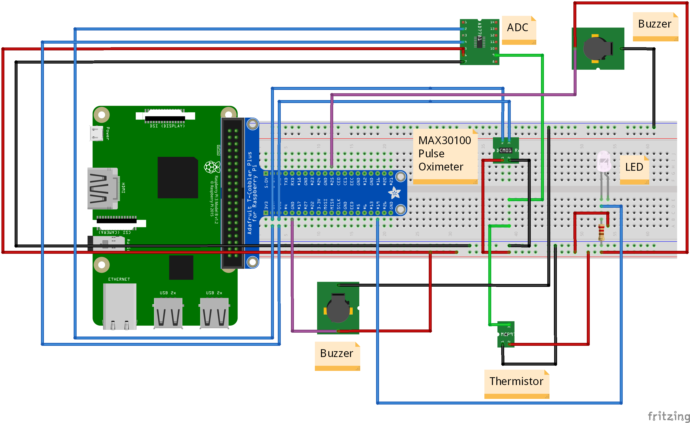

# Cardio-Safe
## Installation
In order to run the Cardio-Safe App and have it read the sensor data from the raspberry pi, in addition to the Raspian OS, Python 3, and XCode / Android Studio, the following packages are required to be installed.

On the Raspberry Pi:
```
sudo apt-get install
sudo pip3 install paho-mqtt
sudo pip install twilio
```

On the device running the application:
```
pip install paho-mqtt
pip install twilio
```
In order to install flutter on your device, follow the installation tutorial at the following link:
https://flutter.io/docs/get-started/install/windows

After installing the flutter plugin, open the project on Android Studio / XCode and enable any Virtual Devices / Emulators necessary to run the app, you may need to configure BIOS settings to allow you to do so.


To run the Flutter App from an Android phone, follow the following link to the Google Play Store:

REMEMBER TO START THE SERVER(server.py) FROM THE RASPBERRY PI BEFORE OPENING THE APP OR RUNNING THE EMULATOR

MAKE SURE IT IS IN THE SAME FOLDER AS sensor_file.py

For Breadboard information, check out the following image:

